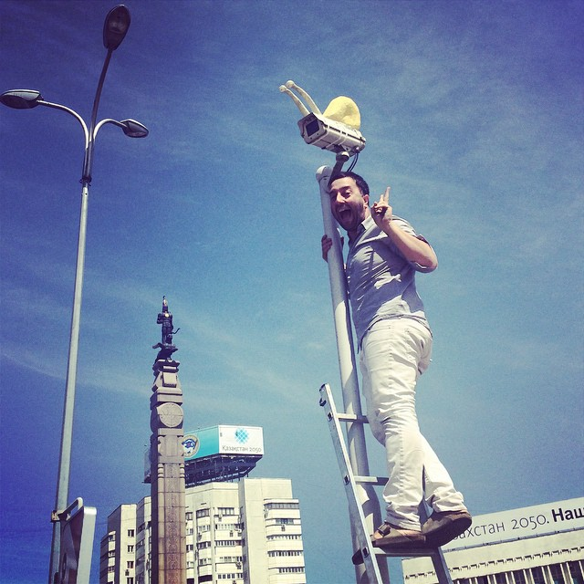

Die Besucher*innen der Ausstellung sind eingeladen in intra-aktion mit Beton zu gehen. Jeder Guss lässt 4 Personen zu. Die Dauer des Erhärtens liegt bei ca 20 min.

sdsucher scheinen fern zu sein. Irgendwann merkt man, dass man nicht mehr den Beton hält, sondern von ihm gehalten wird. Während er abbindet, erwärmt sich der Beton; anfangs kaum merkbar. Bei 40°C ist er ein fester Stein der passgenauer jede Hautfalte füllt. Das Auslösen erfordert Geduld. [Finger](https://www.google.at)

## Eine Überschrift

Eigengewicht gegen uns. Langsam verschwimmen die Körpergrenzen - Körper; Eigengewicht gegen uns. Langsam verschwimmen die Körpergrenzen - Körper; Stein; fremder Körper… Die Gruppe ist für sich - ein bisschen wie ums Lagerfeuer; die anderen Ausstellungsbesucher scheinen fern zu sein. Irgendwann merkt man, dass man nicht mehr den Beton hält, sondern von ihm gehalten wird.




  {{}}
