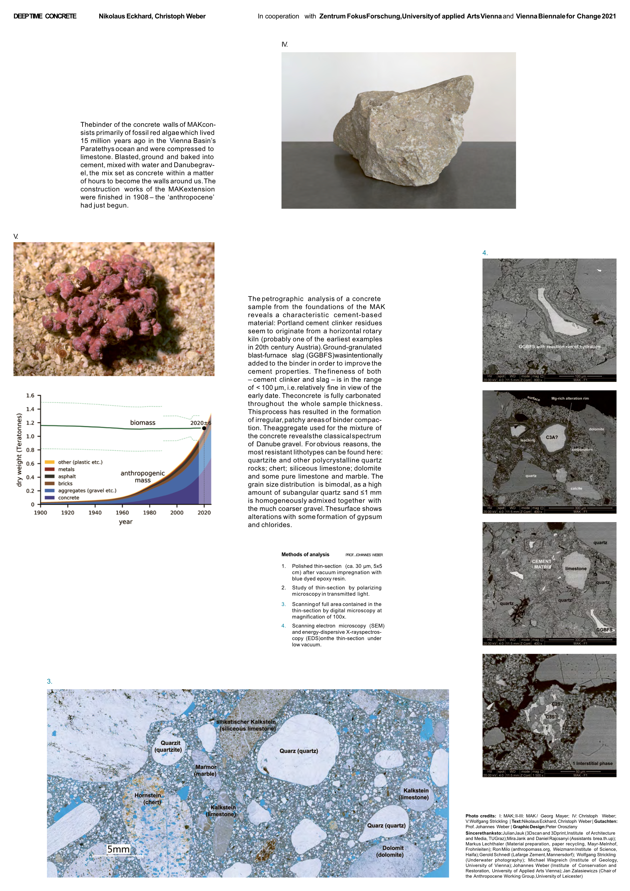

Currently, more than half of the mass made by humans is concrete. Since 2020, this is more than the planet’s biomass and consequently larger than the mass of all plants, animals, fungi, bacteria, and humans together. If this trend continues, in 20 years, the anthropogenic mass will be three times as much as the biomass.
Nikolaus Eckhard is working with, on, and against concrete. Together with Christoph Weber he develops artistic research projects to address human interaction with this fossil building material in the context of the geological dimensions that turn it into the dominating material of the Anthropocene.
“Deep Time MAK” was realised within the artistic research project “Greenwashed Concrete” situated University of applied Arts Vienna and in cooperation with Vienna Biennale for Change 2021. 
The project consists of a deep time investigation of the museum building as well as the following works:
“Archiving the Redundant Information” 2022 print - Christoph Weber
“Archiving the Redundant Information” 2021 Paper-pulp from recycled paper with clay and limestone powder – Christoph Weber
“Geschiebe in Form gehalten” 2021 danube-sand and starch, squeezed and baked – Nikolaus Eckhard “The Speculative Fossilisation of the MAK” 2021, short essay – Nikolaus Eckhard


  {{}}
  {{}}
  {{}}
  {{}}
  {{}}

