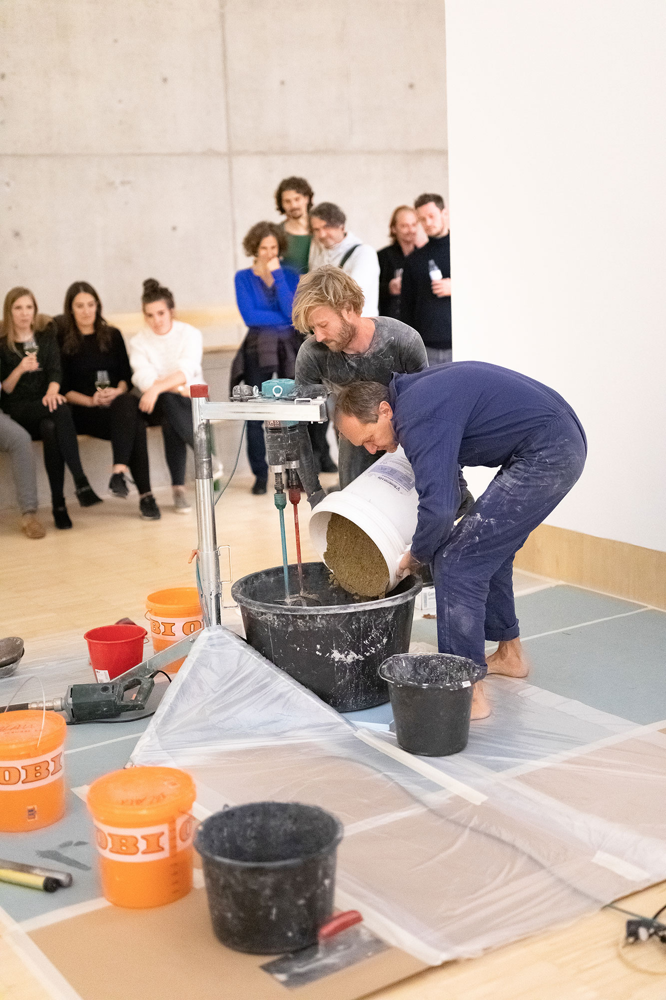
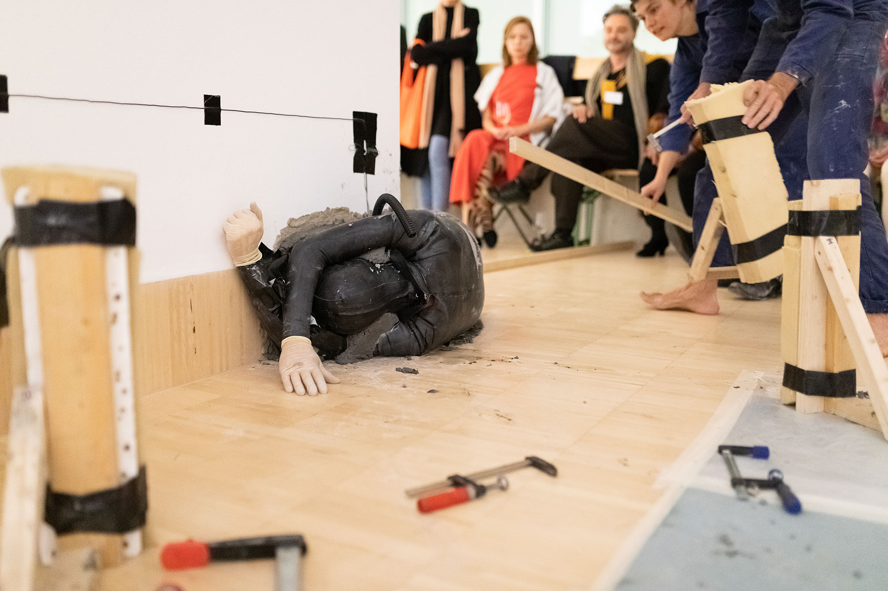

brea.th.through
Der globale Bestand an Beton wächst pro Jahr um ca. 27milliarden Tonnen – eine Masse die etwa doppelt so viel ist wie die allen Sediments das, von Flüssen bewegt, jährlich das Meer erreicht.  Die uns umschließenden Betonräume werden täglich härter während wir nicht mal fassen können was Beton überhaupt ist. Adrian Forty schreibt: „From many of the usual category distinctions through which we make sense of our lives - liquid/solid, smooth/rough, natural/artificial, ancient/modern, base/spirit - concrete manages to escape, slipping back and forth between categories.”  
Vielleicht werden die ArchäologInnen der Zukunft einmal auf die Skelette unserer Gebäude schauen und sie als Teil unserer eigenen Skelette begreifen.

In seiner Performance/Skulptur brea.th.through geht Nikolaus Eckhard  in Inter-aktion mit dem Ausstellungsgebäude: dem Essl Museum - getragen und gestürzt vom Aufstieg und Konkurs Österreichs führender Baumarktkette.




  {{}}
  {{}}
  {{}}
  {{}}
  {{}}
  {{}}
  {{}}
  {{}}
  {{}}
  {{}}
  {{}}
  {{}}
  {{}}
  {{}}
  