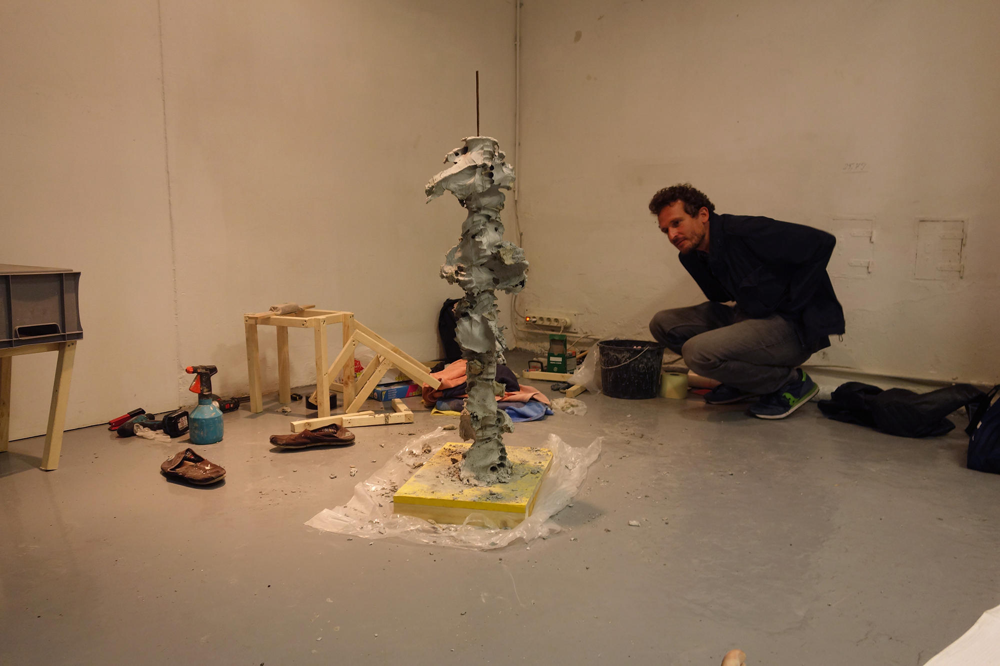

Your hands are closely placed next to the ones of your co-participants. The remaining gaps between the hands are stuffed with clay. You have some time to chat with your fellow participants while the concrete mixing starts next to you. The consistency of the fresh concrete is similar to that of honey. You feel the cold liquid stone being poured into your hands and sense the weight of the concrete pushing against them. Then you collectively hold still and you wait. Slowly the bodily boundaries start to blur – flesh, stone, your own hands, other people’s hands. Other visitors of the exhibition stand nearby observing, maybe commenting. Still there is a certain intimacy within the group, as if sitting around a campfire. At some point your hands aren’t holding the concrete anymore but instead the concrete is holding them. While curing, the cement produces heat. In the beginning you hardly notice it, but the temperature consistently rises. At 40°C the stone hardened within every wrinkle of your skin. It takes some patience to release your hands. Sometimes hammer and chisel is needed. Finger by finger you regain your own body from the cooling stone.




  {{}}
  {{}}
  {{}}
  {{}}
  {{}}

  
